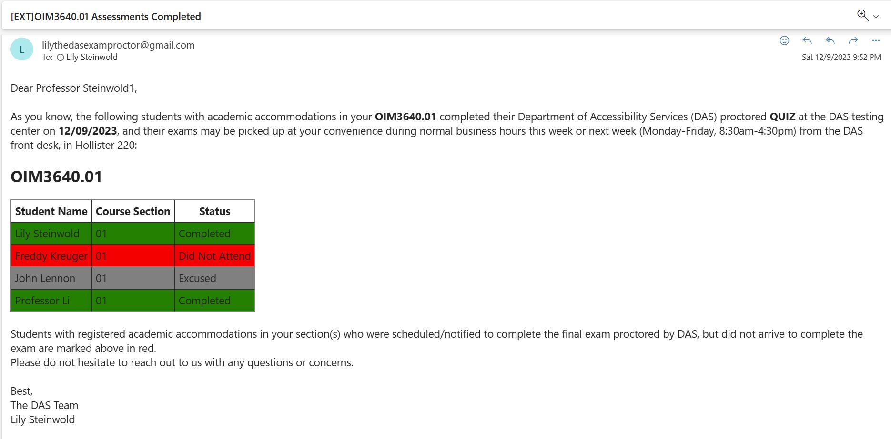

### Lily Steinwold

[](https://www.babson.edu/health-and-wellness/advising-and-support/accessibility-services/)

`Click` on Biz E to learn more about Accessibility Services and their great work!

**How to Run**

1. Check you've got all the packages installed
2. Run code and follow all terminal prompting
2a. Proctors use Professors email
2b. Testers use personal Babson email
3. Sign into gmail with username & password given 
4. Hit 'Advanced Settings'
5. Click run Accessibility Email Sender

**Original Template**


```
* Had to manually enter Professor Name, Course, Section, Assessment Type, Date
* Had to create the chart in Excel then copy it over
* Lots of space for error (Example: Forgetting to change date)
* Took approxiametely 3 minutes per exam
* Usually overseeing 5 exams per shift
```

**Automated System**

```
* So much easier- just have to type information in
* Takes less than 30 seconds per exam
* Reduces chance of error
```
